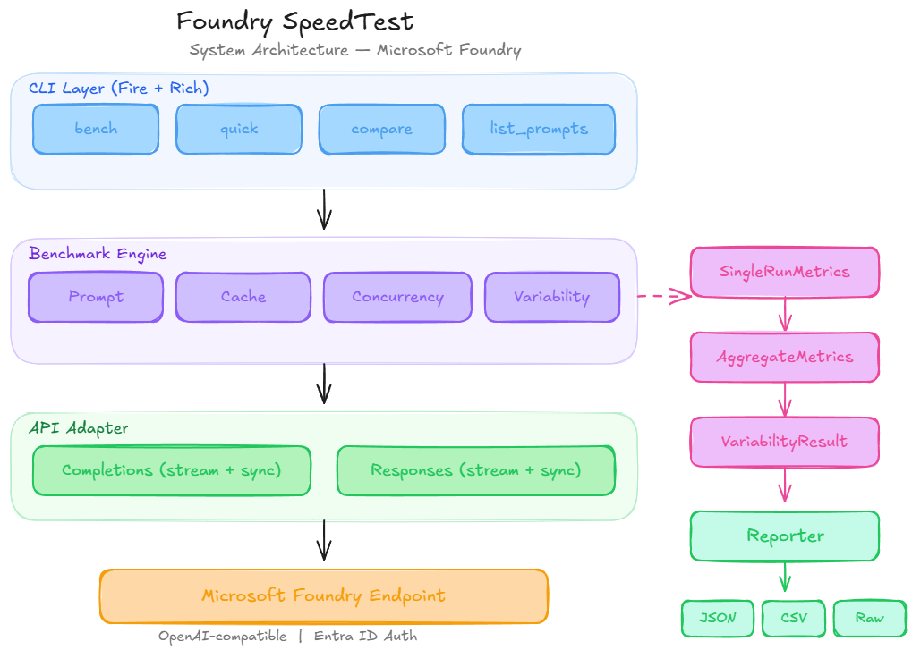

# ⚡ Foundry SpeedTest

> **Matrix-themed CLI benchmark suite for Microsoft Foundry models**
>
> Compare **Completions API** vs **Responses API** head-to-head with real latency metrics, throughput analysis, and cache behaviour testing — all from your terminal.

```
 ██████╗ ██████╗ ██╗   ██╗███╗   ██╗██████╗ ██████╗ ██╗   ██╗
 ██╔═══╝ ██╔══██╗██║   ██║████╗  ██║██╔══██╗██╔══██╗╚██╗ ██╔╝
 █████╗  ██║  ██║██║   ██║██╔██╗ ██║██║  ██║██████╔╝ ╚████╔╝
 ██╔══╝  ██║  ██║██║   ██║██║╚██╗██║██║  ██║██╔══██╗  ╚██╔╝
 ██║     ██████╔╝╚██████╔╝██║ ╚████║██████╔╝██║  ██║   ██║
 ╚═╝     ╚═════╝  ╚═════╝ ╚═╝  ╚═══╝╚═════╝ ╚═╝  ╚═╝   ╚═╝
  ░▒▓ S P E E D T E S T  ·  M i c r o s o f t  F o u n d r y ▓▒░
```

---

## 📊 What It Measures

| Metric | Description |
|--------|-------------|
| **TTFT** | Time to First Token — how fast the stream starts (streaming mode) |
| **Total Time** | Wall-clock time for the full response |
| **Tokens/sec (TPS)** | Output throughput — tokens generated per second |
| **Input / Output Tokens** | Token counts reported by the API |
| **Cache Hit / Miss** | Detects prompt caching via `cached_tokens` in usage |
| **Concurrent Throughput** | Parallel request performance under load |
| **P50 / P90 / P99** | Percentile latencies across multiple runs |
| **Error Rate** | Failed requests as a percentage of total |

Tests run against **both** the **Completions API** (`chat.completions.create`) and the **Responses API** (`responses.create`) in streaming and non-streaming modes.

---

## 📖 Metric Glossary

### Column Reference (Live Results & Run Tables)

| Column | Meaning |
|--------|---------|
| **#** | Sequential run number |
| **API** | Which API was used — `completions` (cyan) or `responses` (magenta) |
| **Prompt / Test** | The benchmark prompt set that was used (e.g. "Short (trivial)", "Cache test") |
| **Stream** | `✓` = streaming mode, `—` = non-streaming (sync) mode |
| **Mode** | `⇣` = streaming, `●` = sync (compact form used in the live panel) |
| **TTFT** | **Time to First Token** — time from request sent to first streamed chunk received. Only measured in streaming mode; shows `—` for sync requests |
| **Total** | **Total Time** — wall-clock duration from request start to final token received |
| **TPS** | **Tokens Per Second** — `output_tokens / total_time`. Measures generation throughput |
| **In Tok** | Number of input (prompt) tokens as reported by the API's `usage` object |
| **Out Tok / Out** | Number of output (completion) tokens generated |
| **Cached** | Number of prompt tokens served from the server-side prompt cache (`cached_tokens` from usage). `—` or `·` when zero |
| **Cache** | Same as Cached, compact form in the live panel |
| **Status** | `✓` (green) = request succeeded · `✗` (red) = request failed with an error |

### Aggregate Statistics

| Stat | Meaning |
|------|---------|
| **Runs** | Total number of measured runs (excludes warmup) |
| **Err%** | Percentage of runs that returned an error |
| **Mean** | Arithmetic average across all successful runs |
| **Median / P50** | Middle value — 50th percentile |
| **P90** | 90th percentile — value below which 90% of runs fall. Represents "worst realistic case" |
| **P99** | 99th percentile — tail latency |
| **StdDev** | Standard deviation — measures consistency. Low = stable, high = variable |
| **Avg In / Avg Out** | Average input and output token counts across runs |
| **Cache Hit%** | Percentage of runs where `cached_tokens > 0` |

### Cold Start Panel

| Indicator | Meaning |
|-----------|---------|
| **1st TTFT** | Time to first token on the very first streaming request. Often higher due to model loading or container cold start |
| **Avg TTFT (rest)** | Average TTFT of all subsequent streaming requests (after the first) |
| **Cold Penalty** | `1st TTFT − Avg TTFT (rest)`. Positive = first call was slower. Shown in ms |
| **▓▓▓ COLD** | Cold penalty > 100 ms — significant cold start detected |
| **▓▓░ WARMING UP** | Cold penalty 30–100 ms — mild warm-up overhead |
| **▓░░ HOT** | Cold penalty < 30 ms — endpoint was already warm |
| **Cache Hit Rate** | Fraction of successful runs where cached tokens were returned |
| **Cached Tokens** | Total cached tokens across all runs in the session |

### Variability / Determinism Panel

| Column | Meaning |
|--------|--------|
| **API** | Which API was tested |
| **Mode** | `No seed` = baseline variability test · `seed=42` = reproducible output mode |
| **Runs** | Number of successful identical requests made |
| **Avg Similarity** | Mean pairwise text similarity across all output pairs (0–100%). Uses Python `SequenceMatcher` |
| **Min / Max Similarity** | Lowest and highest pairwise similarity observed |
| **Fingerprint Consistent** | `✓` = all `system_fingerprint` values matched · `✗ differs` = backend config changed between calls |
| **Verdict** | Determinism classification based on average similarity |

| Verdict | Avg Similarity | Meaning |
|---------|---------------|--------|
| **✓ Deterministic** | ≥ 95% | Outputs are essentially identical across runs |
| **≈ Mostly deterministic** | 75–95% | Outputs share most content but diverge in phrasing |
| **~ Semi-variable** | 50–75% | Noticeable differences; common themes but different wording |
| **✗ Non-deterministic** | < 50% | Each output is substantially different |

> **Note:** Per [Azure docs](https://learn.microsoft.com/en-us/azure/ai-foundry/openai/how-to/reproducible-output), determinism is not guaranteed even with `seed`. Larger `max_tokens` values produce less deterministic results. The `system_fingerprint` tracks backend configuration changes that can affect reproducibility.

### Slow Runs Tracker (🐢)

Appears after the aggregate statistics when **any** successful run exceeds the 1-second threshold:

| Column | Meaning |
|--------|---------|
| **#** | Run number (matches the "All Runs" table) |
| **API** | `completions` or `responses` |
| **Test** | Prompt / test name |
| **Stream** | `✓` streaming, `—` sync |
| **TTFT** | Time to First Token for that run |
| **Total** | Total wall-clock time for that run |
| **TPS** | Tokens per second |
| **Flags** | Which threshold was breached — `TTFT > 1s`, `Total > 1s`, or both |

> This panel helps pinpoint individual outlier runs that drag up your P90/P99 numbers — useful for identifying cold starts, throttling, or network blips.

### TTFT / TPS Colour Coding

| Colour | TTFT Meaning | TPS Meaning |
|--------|-------------|-------------|
| 🟢 **Green** | < 200 ms — fast | > 80 tok/s — fast |
| 🟡 **Yellow** | 200–500 ms — moderate | 30–80 tok/s — moderate |
| 🔴 **Red** | > 500 ms — slow | < 30 tok/s — slow |

### Head-to-Head Comparison

When running with `--apis both` (default), a comparison panel shows each metric for Completions vs Responses with the **Winner** highlighted — lower is better for latency metrics, higher is better for throughput.

---

## 🏗️ Architecture



> Full Mermaid diagram: [`docs/architecture.mmd`](docs/architecture.mmd)

---

## 📁 Project Structure

```
Foundry-SpeedTest/
├── foundry_speedtest/          # Main package
│   ├── __init__.py
│   ├── __main__.py             # python -m entry point
│   ├── cli.py                  # Fire CLI + Rich Matrix UI
│   ├── benchmarks.py           # Test orchestrator
│   ├── adapters.py             # Completions & Responses API wrappers
│   ├── metrics.py              # SingleRunMetrics + AggregateMetrics
│   ├── config.py               # Prompts, BenchmarkConfig
│   └── reporter.py             # JSON/CSV export
├── API/                        # Sample standalone scripts
│   ├── completions_connection.py
│   └── responses_connection.py
├── docs/
│   └── architecture.mmd        # Mermaid architecture diagram
├── .env.example                # Template for env vars
├── .gitignore
├── pyproject.toml
└── README.md
```

---

## 🚀 Quick Start

### Prerequisites

- **Python 3.10+**
- **Microsoft Foundry** resource with a deployed model
- **Azure CLI** logged in (`az login`) — used for Entra ID authentication

### 1. Clone & Setup

```bash
git clone https://github.com/<your-username>/Foundry-SpeedTest.git
cd Foundry-SpeedTest

# Create virtual environment
python -m venv .venv

# Activate it
# Windows PowerShell:
.venv\Scripts\Activate.ps1
# macOS/Linux:
source .venv/bin/activate
```

### 2. Install

```bash
pip install -e .
```

### 3. Configure

```bash
# Copy the example env file
cp .env.example .env

# Edit .env with your Foundry endpoint
# AZURE_FOUNDRY_ENDPOINT=https://<your-resource>.openai.azure.com/openai/v1
```

If your Foundry project has **AI Gateway** enabled, keep
`AZURE_FOUNDRY_ENDPOINT` for Chat Completions and add a Responses-specific
project/gateway endpoint:

```bash
# Microsoft Learn project endpoint form; /openai/v1 is appended automatically
AZURE_FOUNDRY_PROJECT_ENDPOINT=https://<your-resource>.services.ai.azure.com/api/projects/<project-name>

# Or use the exact gateway/OpenAI v1 base URL
AZURE_FOUNDRY_RESPONSES_ENDPOINT=https://<gateway-or-project-endpoint>/openai/v1
```

For APIM-backed gateway URLs that require a subscription key, set
`AZURE_FOUNDRY_GATEWAY_SUBSCRIPTION_KEY` in your local `.env`. Never commit real
subscription keys.

### 4. Authenticate

```bash
# Make sure you're logged in to Azure
az login
```

### 5. Run

```bash
# Quick connectivity check
python -m foundry_speedtest quick gpt-4.1-nano

# Full benchmark suite
python -m foundry_speedtest bench gpt-4.1-nano

# Compare two models head-to-head
python -m foundry_speedtest compare gpt-4.1-nano gpt-4.1-mini
```

---

## 🔥 CLI Commands

### `bench` — Full Benchmark Suite

```bash
python -m foundry_speedtest bench <model> [OPTIONS]
```

| Option | Default | Description |
|--------|---------|-------------|
| `--iterations` | `3` | Measured runs per prompt/API combo |
| `--warmup` | `1` | Warmup runs (discarded) |
| `--max_tokens` | `512` | Max output tokens per request |
| `--temperature` | `0.7` | Sampling temperature |
| `--concurrency` | `5` | Parallel requests for throughput test |
| `--cache_rounds` | `5` | Identical calls for cache detection |
| `--apis` | `both` | `both`, `completions`, or `responses` |
| `--prompts` | `all` | `all` or comma-separated: `short,medium,long,code,reasoning` |
| `--timeout` | `120` | Request timeout (seconds) |
| `--output` | `all` | Export: `all`, `json`, `csv`, or `none` |

**Examples:**

```bash
# Test only Completions API with 5 iterations
python -m foundry_speedtest bench gpt-5.2 --apis completions --iterations 5

# Short + code prompts only, no file export
python -m foundry_speedtest bench gpt-4.1-nano --prompts short,code --output none

# High concurrency stress test
python -m foundry_speedtest bench gpt-4.1-nano --concurrency 20 --cache_rounds 10
```

### `quick` — Fast Connectivity Check

```bash
python -m foundry_speedtest quick <model>
```

Runs a single medium prompt across both APIs (streaming + sync) — good for verifying your setup works.

### `compare` — Model vs Model

```bash
python -m foundry_speedtest compare <model1> <model2>
```

Side-by-side comparison across short/medium/long prompts with a winner declared per metric.

### `list_prompts` — Show Prompt Catalogue

```bash
python -m foundry_speedtest list_prompts
```

---

## 📂 Output & Reports

Results are saved to the `results/` directory:

| File | Contents |
|------|----------|
| `benchmark_<model>_<timestamp>.json` | Full structured results with nested stats |
| `benchmark_<model>_<timestamp>.csv` | Aggregate summary (one row per test) |
| `benchmark_<model>_<timestamp>_raw.csv` | Every individual API call logged |

---

## 🧪 What Gets Tested

| Test | Streaming | Non-Streaming | Description |
|------|:---------:|:-------------:|-------------|
| **Short prompt** | ✓ | ✓ | Trivial question → measures overhead |
| **Medium prompt** | ✓ | ✓ | Technical explanation → balanced test |
| **Long prompt** | ✓ | ✓ | Tutorial generation → heavy output |
| **Code generation** | ✓ | ✓ | Python function → structured output |
| **Reasoning** | ✓ | ✓ | Multi-step logic → reasoning latency |
| **Cache warm/cold** | ✓ | — | Identical prompt repeated N times |
| **Concurrency** | — | ✓ | Parallel requests for throughput |
| **Variability** | — | ✓ | Determinism test: with and without `seed` |

---

## 🔐 Authentication

This tool uses **Azure Entra ID** (via `DefaultAzureCredential`) — no API keys stored in code. It picks up credentials from:

1. `az login` session
2. Environment variables (`AZURE_CLIENT_ID`, etc.)
3. Managed Identity (when running in Azure)
4. VS Code Azure account

---

## License

MIT
